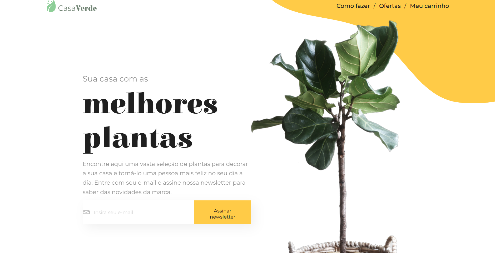

    <h1>Casa Verde ecommerce</h1>
    
<a href='./README.pt-br.md' style='cursor: pointer'>PT - README</a> || <a href='./README.md'style='cursor: pointer'>ENG - README</a>

    <h2>PREVIEW</h2>
    </img>
    <h1><a style='text-decoration: none; text-transform: uppercase' href='https://willowy-sopapillas-7e536a.netlify.app/' target='_blank'>SEE LIVE 🚀</a></h1>
    <h2><a style='text-decoration: none; text-transform: uppercase' href='https://github.com/itsdamel/casaverde-public-server' target='_blank'>BACKEND-REPOSITORY</a></h2>

    <h2>Desarrollado con:</h2>
    
    
    
    

    <h2>Características.</h2>
    <h3>
        Este proyecto es uno de los desafíos de <a href='https://alura-7dayscode.vercel.app/' target='_blank'>ALURA #7DAYSOFCODE</a>.   El objetivo de este desafío era:
    </h3>     
    <ul style="text-align: left">
        <li>Crear una homepage para un comercio digital.</li> 
        <li>Utilizar la API de SendGrid para enviar un correo de confirmación de suscripción al newsletter.</li> 
        <li>Fetch la URL con mock data para mostrar dinámicamente las plantas en la sección de ofertas.</li> 
        <li>Utilizar styled components para dar estilo a la página.</li> 
        <li>Crear un filtro para que los usuarios puedan manipular cómo se muestran las plantas.</li>
    </ul>
    

    <h3>
        Las características adicionales que he incorporado en la aplicación son:
    </h3>     
    <ul style="text-align: left; font-size: 16px">
        <li> 100 % de capacidad de respuesta en todos los tamaños de pantalla, garantizando una experiencia de usuario fluida. Esto incluyó ocultar selectivamente ciertos elementos en pantallas más pequeñas.</li> 
        <li> Introducción de una funcionalidad de carrito de compra compleja que permite a los usuarios controlar el precio total de sus compras, ajustar las cantidades de los productos y eliminar artículos según sea necesario..</li>   
        <li> Generación de mock data con json-server para poblar la sección de ofertas de productos durante el desarrollo.</li> 
        <li> Desarrollo de un servidor backend utilizando Node.js y Express. Este servidor permite tanto solicitudes POST para interactuar con la API de SendGrid como solicitudes GET para recuperar datos del mock-data implementado.</li> 
        <li> Personalización de pop ups para, por ejemplo, informar a los usuarios sobre direcciones de correo electrónico no válidas en la suscripción al newsletter y confirmar la adición de elementos al carrito de compra.</li>      
    </ul>
    

    <h2>Buenas prácticas:</h2>
    
Dedicé un esfuerzo significativo a la organización de la fold estrucre del proyecto para garantizar la claridad y la facilidad de mantenimiento. Esto incluye directorios para páginas, hooks, componentes, contextos y styled componets compartidos. También me aseguré de aprovechar al máximo las características de React y utilicé la contect API para evitar prop drilling

    <h2>Dev's thoughts</h2>
    
Este es mi segundo proyecto exclusivamente dedicado a mi portafolio. En comparación con mi primer proyecto, Casa Verde requirió un conocimiento más amplio de diversas tecnologías. ¡Crear un servidor Node para obtener mi API fue increíblemente divertido! Seguramente he mejorado en la lectura de documentación, jaja.

    
Los proyectos de comercio digital son muy comunes, y ahora entiendo por qué. Fue una oportunidad increíble para mostrar y mejorar mis habilidades. La manipulación de datos aquí fue muy similar a lo que hice en mi proyecto de películas populares, ¡pero vaya! ¡La práctica realmente da sus frutos! Lo hice mucho más rápido esta vez.
 
    
Llevo tiempo desarrollando con React, por lo que no fue un gran desafío, pero trabajar con styled components fue una experiencia completamente nueva para mí. Había leído sobre ello antes, pero esta fue la primera vez que lo utilizey, ¡vaya, qué salvavidas! Consulté toda la documentación oficial para garantizar una organización adecuada.
   
    
En general, Casa Verde fue un proyecto fantástico del que he aprendido muchísimo!

    
Si has llegado hasta aquí, ¡gracias por tu interés y paciencia! ¡Espero sinceramente que tengas un día maravilloso :)

